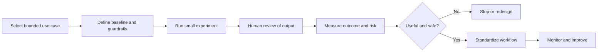

# AI-Assisted Engineering Playbook

Practical patterns for introducing AI assistance into software delivery while preserving engineering judgment, security, privacy, quality, and accountability.

The goal is not maximum tool usage. The goal is measurable improvement in valuable outcomes: faster feedback, lower cognitive load, better knowledge access, more consistent engineering practices, and safer production operation.

## Operating Model

## Playbooks

- [Responsible Use Guardrails](responsible-use.md)
- [AI-Assisted Pull-Request Review](pr-review.md)
- [Agent-Oriented Engineering Workflow](agent-workflow.md)
- [AI-Assisted Incident Analysis](incident-analysis.md)
- [Adoption and Outcome Metrics](adoption-metrics.md)

## Templates

- [AI Experiment Canvas](ai-experiment.md)
- [AI Workflow Risk Review](workflow-risk-review.md)

## Core Principles

1. **Humans remain accountable.** AI can propose, summarize, and check; accountable engineers decide and approve.
2. **Context is permissioned.** Provide only the data necessary for the task and respect classification, privacy, and regulatory boundaries.
3. **Verification matches risk.** Generated tests, documentation, and code require evidence appropriate to their possible impact.
4. **Start bounded.** Choose repeatable workflows with observable outcomes before attempting broad autonomy.
5. **Measure outcomes, not novelty.** Tool activity is not proof of productivity or quality.
6. **Make failure safe.** Prefer reversible actions, dry runs, review gates, and least-privilege access.
7. **Improve the system.** Convert successful experiments into shared prompts, skills, templates, policies, and automation.

## Scope and Provenance

These materials are generalized from practical experience introducing AI-assisted development workflows and exploring AI-assisted root-cause analysis and agent-oriented services. They contain no confidential employer, customer, or product information.
