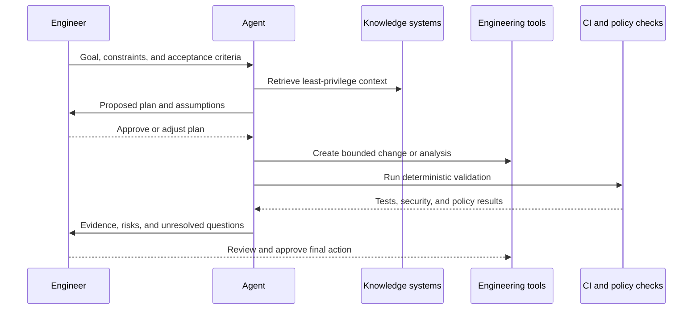

# Agent-Oriented Engineering Workflow

An engineering agent becomes useful when it has a bounded objective, permissioned context, deterministic tools, explicit review gates, and a clear definition of done.

## Reference Flow

## Workflow Contract

Define these elements before implementation:

- **Objective:** the specific outcome the agent should achieve.
- **Allowed context:** repositories, work items, documentation, telemetry, and data classifications.
- **Allowed tools:** read, propose, create branch, comment, run tests, or other explicit capabilities.
- **Prohibited actions:** production changes, credential access, customer communication, or scope expansion unless specifically authorized.
- **Validation:** tests, checks, evidence, and reviewers required.
- **Stop conditions:** uncertainty, failed validation, conflicting instructions, missing access, or elevated risk.
- **Audit record:** inputs, retrieved sources, tool actions, output, and approval.

## Maturity Stages

1. **Assist:** summarize, explain, and suggest.
2. **Prepare:** draft code, tests, documentation, or work items for review.
3. **Execute in isolation:** make changes on a branch or sandbox and run validation.
4. **Orchestrate:** coordinate several approved tools with checkpoints.
5. **Bounded autonomy:** execute proven, reversible actions within explicit policies.

Progress based on evidence, not enthusiasm. A workflow should earn broader permissions through reliability, observability, and demonstrated value.
