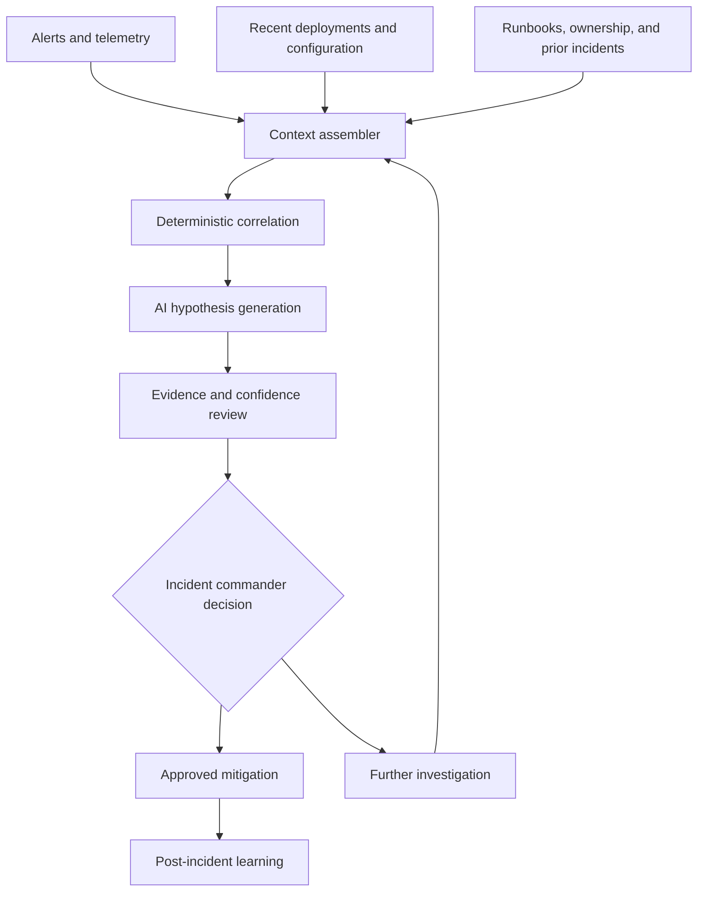

# AI-Assisted Incident Analysis

Live incidents create high cognitive load: signals arrive from many systems, recent changes must be correlated, and responders need to communicate while diagnosing uncertainty. AI can help organize evidence and propose hypotheses, but mitigation remains an accountable operational decision.

## Reference Architecture

## Valuable Assistance

- Assemble a timeline from alerts, deployments, configuration changes, and responder notes.
- Identify service owners, dependencies, runbooks, and relevant historical incidents.
- Correlate incident start time with recent changes.
- Summarize competing hypotheses and the evidence for or against each.
- Propose the next discriminating query or safe diagnostic action.
- Draft stakeholder updates from incident-commander-approved facts.
- Convert review outcomes into proposed runbook, observability, and prevention work.

## Safety Requirements

- Begin with read-only, audited access.
- Separate observed facts, inferred relationships, and generated hypotheses.
- Do not expose sensitive logs or customer data outside approved boundaries.
- Require approval for mitigation and customer communication.
- Prefer proven, reversible remediation with blast-radius controls.
- Preserve a complete action and evidence trail for review.

## Outcome Measures

- Time to detect and acknowledge
- Time to identify a useful hypothesis
- Time to mitigate
- Number of manual context-gathering steps
- Responder cognitive load and satisfaction
- Incorrect correlations or misleading recommendations
- Recurrence of similar incidents

The aim is not to automate judgment. It is to help responders reach better-supported decisions faster.
